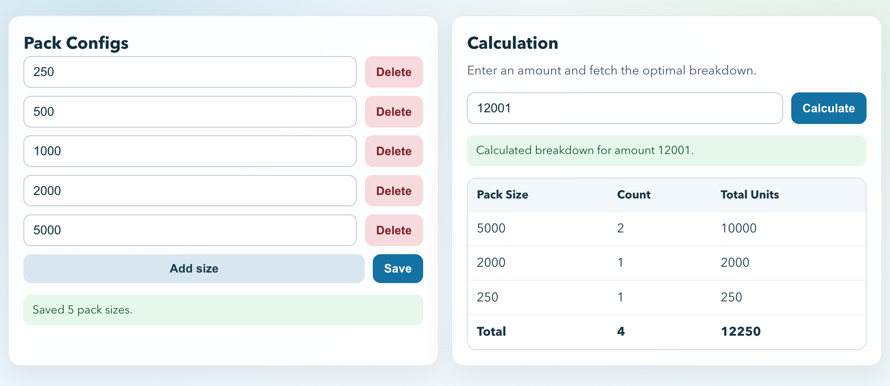

[](https://github.com/Steadfastie/go-packing/actions/workflows/go-ci.yml)
[](https://github.com/Steadfastie/go-packing/actions/workflows/react-build.yml)

# Go Packing Service



## Business Service Description

Go Packing Service is a packing optimization API with a simple UI. It lets you configure available pack sizes and calculate an optimal pack breakdown for any requested amount.

Calculation rules are:

1. Always meet or exceed the requested amount.
2. Minimize overfill (extra shipped units).
3. If overfill is tied, use fewer total packs.

API endpoints:

- `GET /api/v1/pack-sizes` to read current pack sizes
- `PUT /api/v1/pack-sizes` to replace pack sizes
- `POST /api/v1/calculate` to compute a breakdown

## Setup

Run everything locally with Docker Compose.

```bash
docker compose -p packaging up -d
```

What this starts:

- `go-packing-postgres` on `localhost:5400`
- `go-packing-api` on `localhost:8080`
- `go-packing-ui` on `localhost:3000`

Swagger UI:

- `http://localhost:8080/swagger/index.html`

Web UI:

- `http://localhost:3000`

## Usage Examples

### UI

1. Open `http://localhost:3000`.
2. In **Pack Configs**, add sizes `250`, `500`, `1000`, `2000`, `5000`, then click **Save**.
3. In **Calculation**, enter amount `251` and click **Calculate**.
4. You should see a breakdown equivalent to one `500` pack (ships `500` total units).

### Swagger

1. Open `http://localhost:8080/swagger/index.html`.
2. Run `PUT /api/v1/pack-sizes` with:

```json
{
  "pack_sizes": [250, 500, 1000, 2000, 5000]
}
```

3. Run `POST /api/v1/calculate` with:

```json
{
  "amount": 251
}
```

4. Example response:

```json
[
  {
    "size": 500,
    "count": 1
  }
]
```
